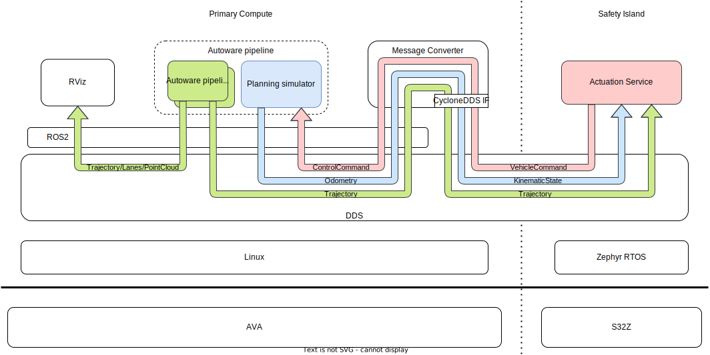
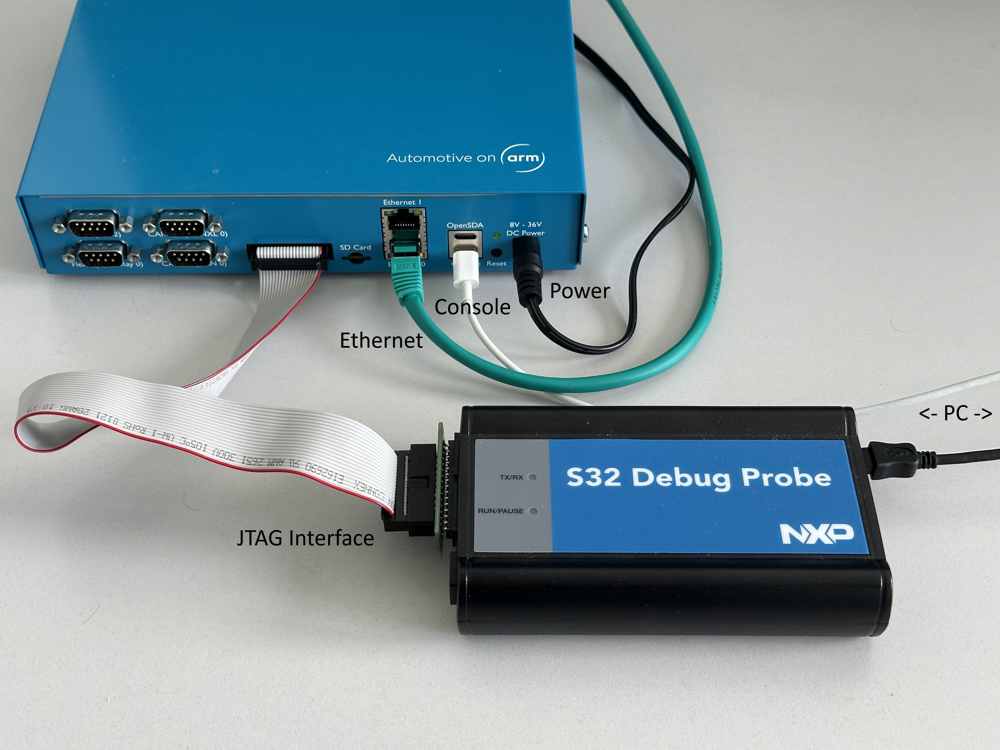

# Autoware Actuation Demo Guide

This repository provides supporting instructions for building and flashing the [ARM Safety Island Actuation Demo](https://safety-island-actuation-demo.docs.arm.com/en/v2.1/) on the NXP S32Z real-time hardware. The guide is specifically tailored to the ARM Cortex-R Automotive Development System and serves as a reference for integrating real-time actuation with Autoware.

<div align="center">
  
</div>

<div align="center" style="font-size: 0.9em; color: gray;">
  Source: © ARM, from the <a href="https://safety-island-actuation-demo.docs.arm.com/en/v2.1/_images/actuation_overview.svg">Actuation Demo Documentation</a>
</div>

## 🛠 About

<details>
<summary>Click to expand</summary>

This repository accompanies our efforts to deploy the controller components of Autoware on the S32Z board while keeping the rest of the Autoware stack (e.g., planning, perception) running on a standard Ubuntu host. The actuation logic is executed on the embedded board using Zephyr RTOS and communicates with the Autoware host via DDS.

Currently, the system is built and run inside a preconfigured Docker container on an ARM-based host system, as described in the official [ARM Safety Island Actuation Demo documentation](https://safety-island-actuation-demo.docs.arm.com/en/v2.1/). All required tools and dependencies are configured correctly within this environment.

> ⚠️ **Note:** Support for newer Autoware versions and for x86 host systems is planned, but not implemented yet.

</details>

## 🔧 Installation & Build Instructions

<details>
<summary><strong>⚙️ Build Instructions (Docker / ARM Host)</strong></summary>

Follow the official [Actuation Demo documentation](https://safety-island-actuation-demo.docs.arm.com/en/v2.1/) to set up the Docker-based build environment.

### ⚠️ Build Considerations for the ARM Cortex-R Board

When working with the ARM Automotive Development System (not the NXP Eval Board):

- **Use the revision D configuration** to ensure proper UART output:

- To enable **Ethernet support**, include the `arm_ethernet.overlay`:
  ```bash
  west build -b <target_board> -- -DEXTRA_DTC_OVERLAY_FILE=arm_ethernet.overlay
  ```

</details>

<details>
<summary><strong>🚀 Flashing Instructions</strong></summary>

We recommend flashing the board via `west`, without using the S32 Design Studio GUI. The following command works reliably with the S32 Debug Probe:

```bash
west debug \
  --s32ds-path=/usr/local/NXP/S32DS.3.6.0/ \
  --elf-file ~/Desktop/actuation_demo_revision-D_arm-board.elf \
  --tool-opt='--batch'
```

### Flashing Tips

- Always specify the **S32DS path** explicitly.
- Use the `--elf-file` flag to flash a specific build artifact.
- The `--tool-opt='--batch'` option ensures that flashing (not debugging) is executed.
- `west flash` does **not** work with the S32 Debug Probe.

</details>

<details>
<summary><strong>📦 Physical Setup</strong></summary>

The image below illustrates how to connect the ARM Cortex-R Automotive Development System to your host PC and the Autoware runtime system.

<div align="center">
  
</div>

### 🔌 Connection Overview

- **Serial (Console) Output**  
  - Used to **read log messages** from the board.
  - This is a **read-only** UART interface.
  - On Linux, the device typically appears as `/dev/ttyUSB*` and can be read with `minicom`, `screen`, or similar tools at 115200 baud.

- **S32 Debug Probe**  
  - Used to **flash and debug** the firmware on the board.
  - Supports GDB-based debugging via `west debug`.
  - Can be connected to the development host via **USB** or **Ethernet**.  
    - So far, only the **USB connection** has been used and verified.
  
- **Ethernet (Data Communication)**  
  - Used for **runtime communication** between the Autoware system and the controller running on the board.
  - This is the **only interface** through which real-time actuation data is exchanged.

---

### ⚠️ Debug Probe Not Detected?

When using Zephyr, some users encounter an issue where the debug probe is **not detected at all** during `west debug`.

If the error occurs immediately when trying to connect, this might be due to incorrect USB vendor/product IDs in the Zephyr runner script:

Check the following [lines](https://github.com/zephyrproject-rtos/zephyr/blob/main/scripts/west_commands/runners/nxp_s32dbg.py#L21
) in your Zephyr installation:

```python
# File: zephyr/scripts/west_commands/runners/nxp_s32dbg.py
NXP_S32DBG_USB_VID = 0x15a2
NXP_S32DBG_USB_PID = 0x0067
```

You can verify the correct values on your machine using:

```bash
lsusb
```

Look for a line like:

```
Bus 001 Device 004: ID 15a2:0067 NXP Semiconductors
```

If the IDs differ, you may need to **manually update** the values in the Python file above.

</details>

## 📦 Provided Files

<details>
<summary>Click to expand</summary>
This repository includes:

- A prebuilt working ELF binary:
  ```
  ELF 32-bit LSB executable, ARM, EABI5 version 1 (SYSV),
  statically linked, with debug_info, not stripped
  ```
  This file was compiled for the ARM Cortex-R board (revision D) and confirmed to work in practice.

- An additional `arm_ethernet.overlay` file for enabling Ethernet routing on the ARM platform.

</details>

## 👥 Maintainer

This project is maintained by 
[Korbinian Moller](mailto:korbinian.moller@tum.de) at the [Professorship of Autonomous Vehicle Systems (AVS)](https://www.mos.ed.tum.de/en/avs/home/) at the Technical University of Munich.


## 📜 License

This project is licensed under the GNU Lesser General Public License. See the [LICENSE](LICENSE) file for full details.
